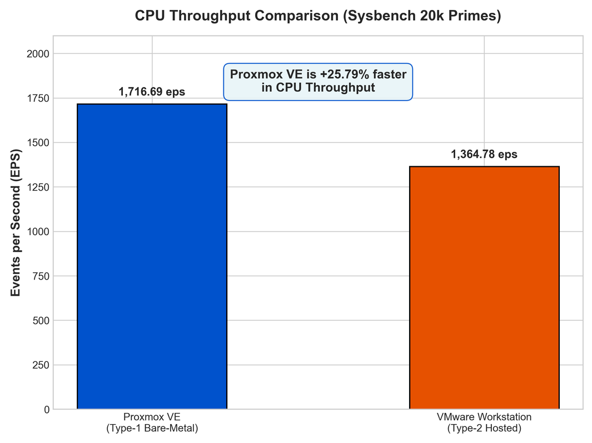
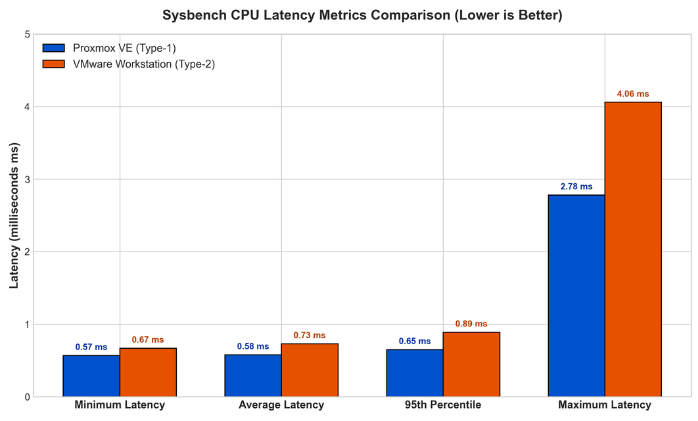
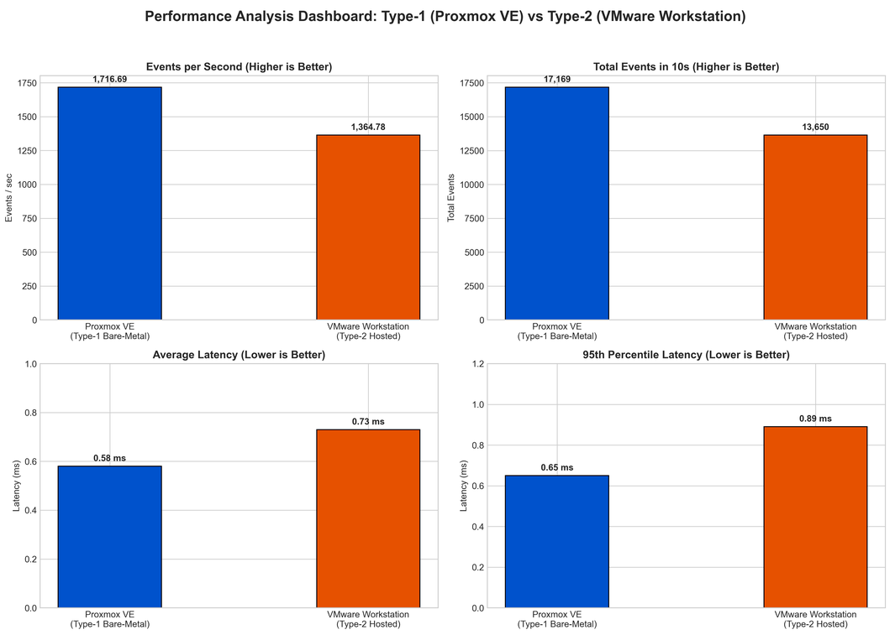

# Hypervisor CPU Performance Study

### Proxmox VE vs VMware Workstation


---

## Overview

This project evaluates the CPU performance of two different virtualization approaches:

* **Proxmox VE** — Type-1 / bare-metal virtualization
* **VMware Workstation** — Type-2 / hosted virtualization

The comparison was performed using identically configured Ubuntu virtual machines. A CPU-intensive `sysbench` workload based on prime-number calculations was used to measure throughput and latency.

The purpose of the experiment was to observe whether the underlying hypervisor architecture produces measurable differences when the guest operating system and allocated VM resources remain the same.

### Main Result

| Hypervisor         |          CPU Throughput |
| ------------------ | ----------------------: |
| **Proxmox VE**     | **1,716.69 events/sec** |
| VMware Workstation |     1,364.78 events/sec |

In this experiment, Proxmox achieved approximately **25.78% greater CPU throughput** than VMware Workstation. Average latency was also lower on the Proxmox VM.

---

## Contents

* [Experiment Goals](#experiment-goals)
* [Virtualization Architectures](#virtualization-architectures)
* [VM Configuration](#vm-configuration)
* [Testing Method](#testing-method)
* [Observed Results](#observed-results)
* [Performance Graphs](#performance-graphs)
* [Discussion](#discussion)
* [Conclusion](#conclusion)
* [Project Files](#project-files)
* [Reproducing the Experiment](#reproducing-the-experiment)

---

# Experiment Goals

The experiment was designed to:

1. Set up an Ubuntu VM using a Type-1 hypervisor.
2. Set up another Ubuntu VM using a Type-2 hypervisor.
3. Keep the major VM resources consistent between both environments.
4. Run the same CPU benchmark on both systems.
5. Record throughput and latency measurements.
6. Compare the results and relate them to the architecture of each hypervisor.

---

# Virtualization Architectures

## 1. Proxmox VE — Type-1

Proxmox VE is installed directly on the physical machine rather than running inside another desktop operating system.

For this experiment, Proxmox uses **KVM** to provide hardware-assisted virtualization to the Ubuntu guest.

```text
+--------------------------------------+
|        Ubuntu Guest VM               |
|      Sysbench CPU Benchmark          |
+--------------------------------------+
|        KVM / Proxmox VE              |
|       Type-1 Hypervisor              |
+--------------------------------------+
|       Physical Computer Hardware     |
|        CPU / RAM / Storage           |
+--------------------------------------+
```

The simplified execution path is:

```text
Physical Hardware
       ↓
Proxmox VE + KVM
       ↓
Ubuntu Virtual Machine
       ↓
Sysbench
```

---

## 2. VMware Workstation — Type-2

VMware Workstation operates as an application within a host operating system.

In this setup, Windows acts as the host OS and VMware Workstation provides the virtualization environment for the Ubuntu guest.

```text
+--------------------------------------+
|        Ubuntu Guest VM               |
|      Sysbench CPU Benchmark          |
+--------------------------------------+
|        VMware Workstation            |
|       Type-2 Hypervisor              |
+--------------------------------------+
|          Windows Host OS             |
+--------------------------------------+
|       Physical Computer Hardware     |
+--------------------------------------+
```

The simplified execution path is:

```text
Physical Hardware
       ↓
Windows Host OS
       ↓
VMware Workstation
       ↓
Ubuntu Virtual Machine
       ↓
Sysbench
```

### Architectural Difference

The major distinction is therefore the layer between the guest VM and physical hardware:

|                            | Proxmox VE             | VMware Workstation |
| -------------------------- | ---------------------- | ------------------ |
| Hypervisor category        | Type-1                 | Type-2             |
| Host OS beneath hypervisor | No separate desktop OS | Windows            |
| Virtualization platform    | KVM                    | VMware VMM         |
| Guest used                 | Ubuntu                 | Ubuntu             |

---

# VM Configuration

Both virtual machines were configured with comparable resources so that the benchmark results would be more meaningful.

| Configuration       | Proxmox VE             | VMware Workstation     |
| ------------------- | ---------------------- | ---------------------- |
| VM Name             | `CC-Experiment1-type1` | `CC-Experiment1-Type2` |
| Guest OS            | Ubuntu 24.04.3 LTS     | Ubuntu Linux 64-bit    |
| vCPU                | 2                      | 2                      |
| RAM                 | 2048 MiB               | 2048 MB                |
| Virtual Disk        | 20 GB                  | 20 GB                  |
| Network             | VirtIO / `vmbr0`       | NAT / VMnet8           |
| Benchmark           | Sysbench 1.0.20        | Sysbench 1.0.20        |
| CPU Benchmark Limit | 20,000 primes          | 20,000 primes          |

The benchmark configuration was kept the same on both guests.

---

# Testing Method

## VM Setup

### Proxmox Environment

The Proxmox VM was created with:

* Ubuntu 24.04 ISO
* 2 virtual CPU cores
* 2 GB RAM
* 20 GB virtual disk
* VirtIO networking

### VMware Environment

The VMware VM was configured with:

* Ubuntu ISO
* 1 processor with 2 cores
* 2 GB RAM
* 20 GB virtual disk
* NAT networking

After installation, the guest systems were checked before running the benchmark.

---

## System Verification

The following commands were used to inspect the VM configuration:

```bash
hostnamectl
lscpu
free -h
df -h
top
```

These commands were useful for checking the hostname, CPU allocation, available memory, storage and current system activity.

---

## Installing Sysbench

The benchmark package was installed inside each Ubuntu VM:

```bash
sudo apt update
sudo apt install sysbench -y
```

The installed version was then checked:

```bash
sysbench --version
```

---

## CPU Benchmark

The same workload was executed in both environments:

```bash
sysbench cpu --cpu-max-prime=20000 run
```

The prime-number calculation workload was selected to provide a CPU-bound test without making disk performance the main factor.

---

# Observed Results

The following values were obtained from the benchmark runs.

| Metric          |   Proxmox VE | VMware Workstation |
| --------------- | -----------: | -----------------: |
| Test duration   |    10.0004 s |          10.0007 s |
| Total events    |   **17,169** |             13,650 |
| Events/sec      | **1,716.69** |           1,364.78 |
| Minimum latency |  **0.57 ms** |            0.67 ms |
| Average latency |  **0.58 ms** |            0.73 ms |
| 95th percentile |  **0.65 ms** |            0.89 ms |
| Maximum latency |  **2.78 ms** |            4.06 ms |

### Throughput Difference

Proxmox processed:

**17,169 − 13,650 = 3,519 additional events**

during the approximately 10-second test.

This corresponds to an observed throughput improvement of approximately:

**25.78%**

over the VMware result.

---

# Experimental Evidence

## Proxmox VE Result

The first screenshot contains the Sysbench output obtained from the Ubuntu VM running under Proxmox VE.


**Figure 1 — Sysbench CPU benchmark executed on the Proxmox VE VM**

---

## VMware Workstation Result

The second screenshot shows the corresponding benchmark execution inside the Ubuntu VM running through VMware Workstation.


**Figure 2 — Sysbench CPU benchmark executed on the VMware Workstation VM**

---

# Performance Graphs

## CPU Throughput



**Figure 3 — Comparison of CPU throughput measured in events per second.**

Proxmox recorded the higher throughput in the experiment.

---

## Latency



**Figure 4 — Latency measurements for both virtualization environments.**

The Proxmox VM recorded lower minimum, average, percentile and maximum latency values.

---

## Total Events



**Figure 5 — Number of benchmark events completed during the test.**

---

## Overall Results


**Figure 6 — Summary dashboard of the measured performance metrics.**

---

# Understanding the Metrics

### Events per Second

This represents the number of benchmark operations completed every second.

**Higher value = better throughput.**

### Total Events

This is the total number of operations completed during the benchmark.

**Higher value = more work completed during the test period.**

### Average Latency

Average time taken for an individual event to complete.

**Lower value = better response time.**

### 95th Percentile Latency

This indicates the latency value below which approximately 95% of the recorded operations completed.

It is useful for identifying whether the system experiences occasional slower operations.

### Maximum Latency

The slowest individual event recorded during the test.

A lower maximum can indicate fewer large latency spikes.

---

# Discussion

## 1. CPU Throughput

The largest difference was observed in CPU throughput.

Proxmox achieved:

**1,716.69 events/sec**

while VMware Workstation achieved:

**1,364.78 events/sec.**

Since the VMs were given the same basic CPU and memory allocation, the difference provides an indication that the virtualization environment and host configuration can influence CPU-bound workloads.

---

## 2. Latency

The Proxmox VM also produced lower latency values.

| Latency Measurement | Proxmox |  VMware |
| ------------------- | ------: | ------: |
| Minimum             | 0.57 ms | 0.67 ms |
| Average             | 0.58 ms | 0.73 ms |
| 95th percentile     | 0.65 ms | 0.89 ms |
| Maximum             | 2.78 ms | 4.06 ms |

The average latency difference was approximately **20.55%**, while the maximum latency was substantially lower in the Proxmox run.

---

## 3. Effect of Virtualization Architecture

A Type-1 hypervisor such as Proxmox operates directly on the physical machine and uses KVM for hardware-assisted virtualization.

VMware Workstation, in comparison, operates within a host operating system.

This does **not** mean that every Type-1 hypervisor will always outperform every Type-2 hypervisor. Actual performance depends on factors such as:

* CPU virtualization support
* Host OS activity
* VM configuration
* CPU scheduling
* Memory management
* Hypervisor implementation
* Background processes
* Hardware configuration

Therefore, the results should be interpreted specifically as the outcome of this experimental setup.

---

# Conclusion

The benchmark produced a measurable performance difference between the two tested virtualization environments.

### Main observations

* **Proxmox VE:** 1,716.69 events/sec
* **VMware Workstation:** 1,364.78 events/sec
* **Throughput difference:** approximately 25.78%
* **Average latency:** 0.58 ms vs 0.73 ms
* **95th percentile latency:** 0.65 ms vs 0.89 ms

For this CPU-bound Sysbench workload, **Proxmox VE provided the stronger measured performance**.

The experiment also demonstrates why hypervisor architecture matters when evaluating virtualization platforms. However, the benchmark represents only one workload, so the results should not be treated as a universal performance ranking of the two products.

---

# Project Files

```text
Cloud_computing/
│
├── README.md
├── LAB_REPORT.md
├── Lab-Manual-Hypervisor-Performance-Analysis (1).docx
│
├── images/
│   ├── 1.png
│   ├── 2.png
│   ├── events_per_second_comparison.png
│   ├── latency_comparison.png
│   ├── total_events_comparison.png
│   └── overall_performance_dashboard.png
│
└── scripts/
    ├── benchmark.sh
    ├── generate_plots.py
    └── parse_sysbench.py
```

---

# Reproducing the Experiment

### 1. Run the benchmark

```bash
chmod +x scripts/benchmark.sh
./scripts/benchmark.sh
```

### 2. Create the visualizations

```bash
python scripts/generate_plots.py
```

### 3. Process the benchmark results

```bash
python scripts/parse_sysbench.py
```

---

## Final Note

This repository contains the configuration details, benchmark outputs, screenshots and visual analysis produced as part of the Cloud Computing / Computer Networks laboratory experiment.
